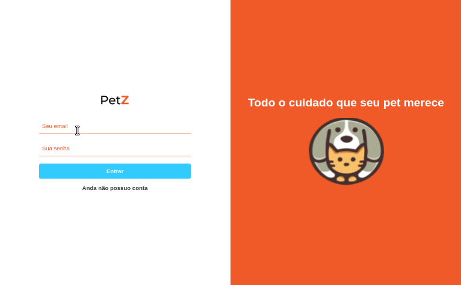

# PetZ - Frontend

## Introdução

O Petz app é uma aplicação para facilitar a comunicação entre clientes que buscam serviços para seus bichinhos e provedores de serviços que possuem estabelecimentos que disponibilizam os serviços requisitados.

Como um cliente na aplicação, você é capaz de:

- Criar, fazer upload de foto para perfil e editar sua conta.
- Adicionar, fazer upload de foto, editar e excluir o cadastro dos seus pets.
- Procurar e agendar serviços para os pets adicionados.

Já como um provedor de serviço, é possível:

- Criar, fazer upload de foto para perfil e editar sua conta.
- Cadastrar, fazer upload de foto, editar e excluir o cadastro de um estabelecimento.
- Cadastar e editar serviços para cada estabelecimento.
- Ver um cronograma diário com todos os agendamentos de cada estabelecimento.

## Demos da aplicação

### Demo de uso da aplicação como cliente

### Demo de uso da aplicação como provedor de serviços

## Técnologias

Esta aplicação é desenvolvida utilizando React e algumas bibliotecas como:

- Redux e redux-saga para gerenciamento de estados
- React router para roteamento da aplicação
- Axios para chamadas para API
- Styled components para estilização de páginas e componentes.

A aplicação consome dados de uma API, com o mesmo nome, desenvolvida em Node.js.

[Link para repositório da API](https://github.com/MateusOli21/petz-backend)
